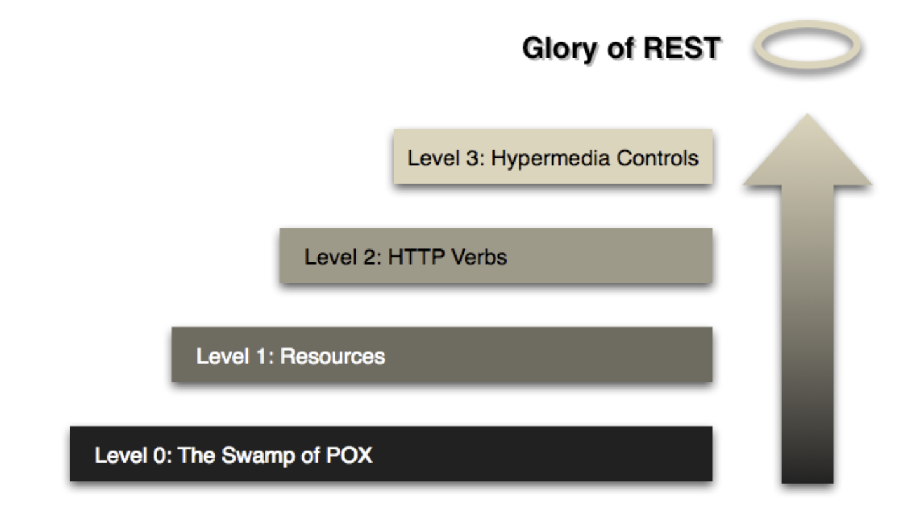

# Gym project

This project is a REST API for user registration.

The main purpose of this project is to demonstrate the implementation of a REST API based on the RMM* (Richardson Maturity Model).


ref: https://martinfowler.com/articles/richardsonMaturityModel.html

### HATEOAS
Hypermedia As The Engine Of Application State is a part of REST application architecture and is a constraint for REST.

This design principle states that when the client interacts with the server, the server provides information dynamically in the form of hypermedia. Due to this client should have very little to no knowledge about how to interact with the server. Here we used a phrase little knowledge because the client should know regarding how to deal with hypermedia.

e.g:
```
{
    "_embedded": {
        "userResponseList": [
            {
                "id": "dc9c8ee2-50e7-44db-8384-06164204cccd",
                "name": null,
                "description": "desc_e",
                "created": null,
                "_links": {
                    "self": {
                        "href": "http://localhost:8080/api/v1/users/dc9c8ee2-50e7-44db-8384-06164204cccd"
                    },
                    "delete": {
                        "href": "http://localhost:8080/api/v1/users/dc9c8ee2-50e7-44db-8384-06164204cccd"
                    }
                }
            },
            {
                "id": "9f5dcf45-095b-4eac-8f26-64e072935cdb",
                "name": "f",
                "description": "desc_f",
                "created": "2023-08-27T16:09:59.967+0100",
                "_links": {
                    "self": {
                        "href": "http://localhost:8080/api/v1/users/9f5dcf45-095b-4eac-8f26-64e072935cdb"
                    },
                    "delete": {
                        "href": "http://localhost:8080/api/v1/users/9f5dcf45-095b-4eac-8f26-64e072935cdb"
                    }
                }
            },
            {
                "id": "9cea54eb-4e66-4fa1-bc00-917770fec9e0",
                "name": "11",
                "description": "desc_11",
                "created": "2023-09-10T05:04:47.405+0100",
                "_links": {
                    "self": {
                        "href": "http://localhost:8080/api/v1/users/9cea54eb-4e66-4fa1-bc00-917770fec9e0"
                    },
                    "delete": {
                        "href": "http://localhost:8080/api/v1/users/9cea54eb-4e66-4fa1-bc00-917770fec9e0"
                    }
                }
            },
            {
                "id": "98520da1-7856-4952-86c5-b5d49753f86b",
                "name": "name_y",
                "description": "desc_y",
                "created": "2023-08-20T06:02:38.383+0100",
                "_links": {
                    "self": {
                        "href": "http://localhost:8080/api/v1/users/98520da1-7856-4952-86c5-b5d49753f86b"
                    },
                    "delete": {
                        "href": "http://localhost:8080/api/v1/users/98520da1-7856-4952-86c5-b5d49753f86b"
                    }
                }
            },
            {
                "id": "fbd69521-e9ff-41dc-be71-8bc78c400442",
                "name": "1",
                "description": "2",
                "created": null,
                "_links": {
                    "self": {
                        "href": "http://localhost:8080/api/v1/users/fbd69521-e9ff-41dc-be71-8bc78c400442"
                    },
                    "delete": {
                        "href": "http://localhost:8080/api/v1/users/fbd69521-e9ff-41dc-be71-8bc78c400442"
                    }
                }
            }
        ]
    },
    "_links": {
        "self": {
            "href": "http://localhost:8080/api/v1/users?page=0&size=20"
        }
    },
    "page": {
        "size": 20,
        "totalElements": 5,
        "totalPages": 1,
        "number": 0
    }
}
```

## Tech stack
- Java 17
- SpringBoot 3.1.1
- Gradle
- Lombok
- JUnit
- Postgres
- Docker

## Run project

```
$./gradlew bootRun
```

## Postman collection
[postman collection](.assets/gym_HATEOAS.postman_collection.json)


